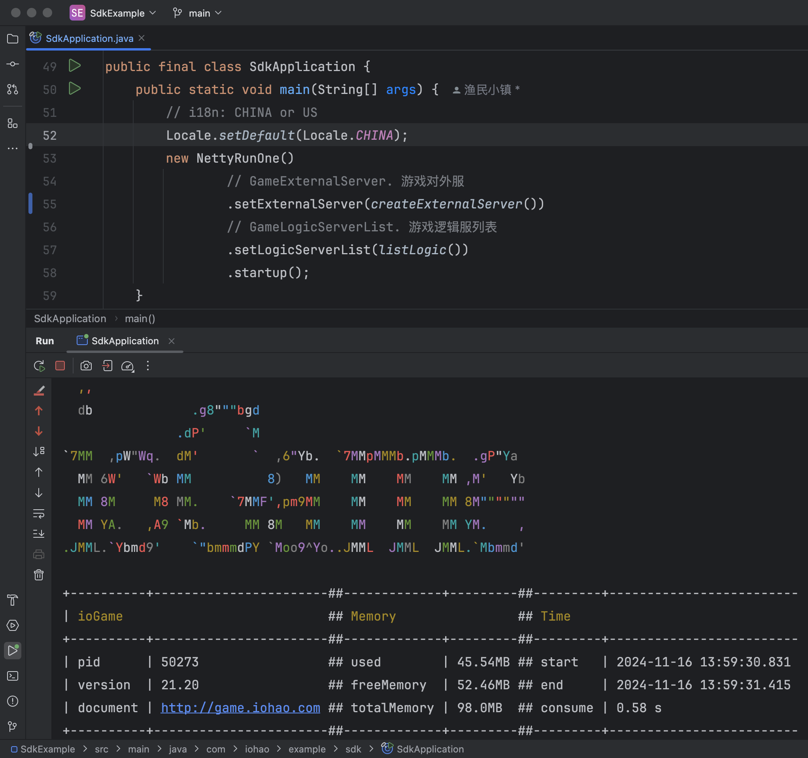
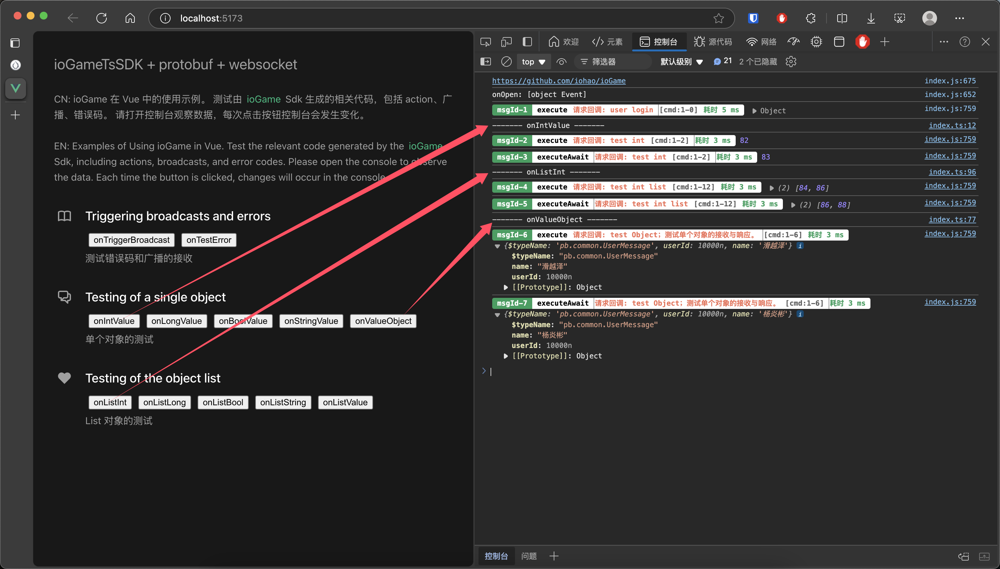

[中文](./README_CN.md)


## ioGameSdkTsExampleVue

ioGame SDK provides a simple encapsulation of Protobuf, webSocket, TypeScript, and Netty game server interaction.


npm https://www.npmjs.com/package/iohao-sdk


This example is a simple demonstration based on Vue. In fact, the SDK is applicable to any relevant projects that support TypeScript, such as CocosCreator, Laya, Vue or various modern front-end frameworks.


The interaction files such as `actions, broadcasts, and error codes` in the `./src/assets/gen/code` directory are generated by the [ioGame SDK TypeScript](https://www.yuque.com/iohao/game/mywnvkhemv8wm396). The code generation of SDK TypeScript can greatly reduce the workload for client developers and shield them from concepts like routing, allowing developers to program towards interfaces.


**The generation of SDK code mainly addresses the following issues and has the following advantages:**

1. Assist client developers in significantly reducing their workload.
2. The parameter types of the methods are safe and clear. It can effectively avoid potential security risks, thereby reducing the occurrence of elementary mistakes during the joint debugging process.
3. The generated joint debugging code can clearly define the required parameter types and also indicate whether an interface method will return data and what kind of data it will return. If an interface method has a callback parameter, it means that the API will have a return value, and the specific value type will be clearly documented in the interface documentation.
4. Reduce the communication costs between the server and the client during the docking process. The generated joint debugging code contains documentation and usage examples, enabling even novice users to minimize the usage cost to nearly zero.
5. Help client developers shield the part of interacting with the server, allowing them to focus more on the actual business operations.
6. Reduce the mental burden for both parties during the joint debugging. The joint debugging code is easy to use, as smooth as calling local methods.
7. Abandon the traditional way of docking based on protocols and instead adopt the docking method oriented towards interface methods.


> With the traditional docking method, after the client sends a request, it is not possible to know what the request will return. This usually requires reading and looking up in the .proto files. When there are fewer protocols, doing so doesn't pose a big problem. However, when there are hundreds of .proto files, this working method is inefficient because there are a large number of interfering factors in the .proto files.


## Quick Start

### Start the ioGame game server

see https://github.com/iohao/ioGameExamples/tree/main/SdkExample

> Run SdkApplication.java




## Installation

```sh
npm install
```


### Start Vue

```sh
npm run dev
```


### Home




## How to generate code

After executing the command, the relevant protos will be generated according to buf.gen.yaml.

```shell
npx buf generate
```


buf.gen.yaml

```yaml
# Learn more: https://buf.build/docs/configuration/v2/buf-gen-yaml
# npx buf generate
version: v2
inputs:
  - directory: proto
plugins:
  - local: protoc-gen-es
    out: src/assets/gen
    opt: target=ts
```


More about the content of.proto generation. https://github.com/bufbuild/protobuf-es/blob/main/MANUAL.md#how-to-generate-code


## Finally

Remember, you don't need to write any interaction files (`actions, broadcasts, error codes`). These are generated by the ioGame server. You only need to focus on the actual business logic.

